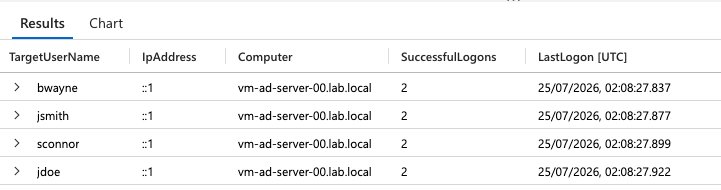
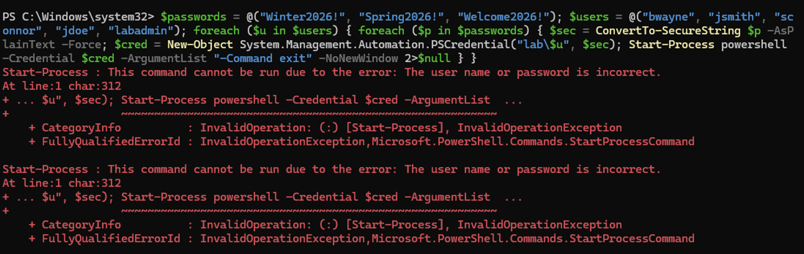
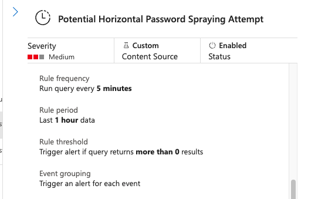
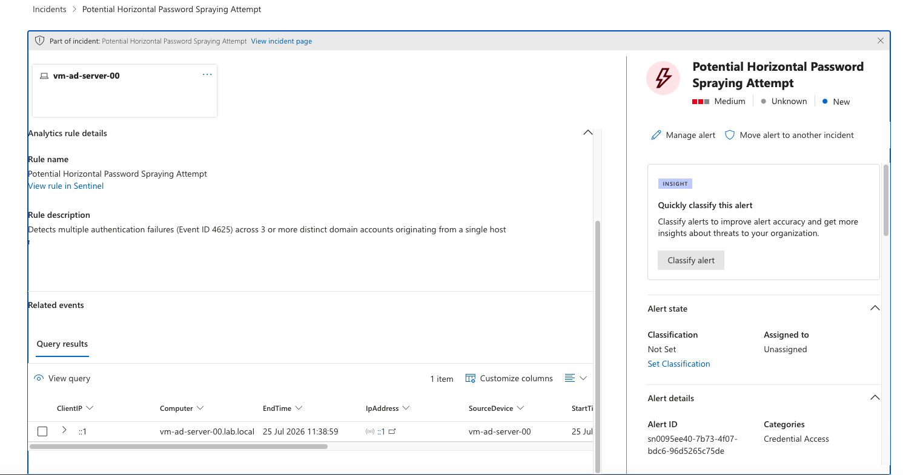

# Evidence: Horizontal Password Spraying Detection

This directory contains screenshots captured during the horizontal password spraying detection scenario.

The evidence follows the workflow from authentication baselining and controlled attack simulation through Microsoft Sentinel rule configuration and Microsoft Defender incident triage.

---

## 1. Authentication Baseline



Normal authentication activity was reviewed before executing the attack simulation to verify that Windows security telemetry was being collected correctly and to establish a baseline for expected logon behaviour.

---

## 2. Password Spraying Simulation



A controlled PowerShell simulation cycled three test passwords across five Active Directory accounts to reproduce horizontal password spraying behaviour.

The simulation generated 15 failed authentication events that were subsequently ingested and analysed through the Microsoft Sentinel detection pipeline.

---

## 3. Sentinel Rule Configuration



The custom Microsoft Sentinel analytics rule was configured to execute every **5 minutes** while analysing authentication activity across a **1-hour lookback period**.

The detection logic identifies activity where:

- At least 3 unique accounts are targeted
- At least 5 authentication failures occur
- Activity is correlated using source host and IP information

The full KQL detection logic is available in [`../detection.kql`](../detection.kql).

---

## 4. Microsoft Defender Incident Triage



After detection validation and rule tuning, Microsoft Sentinel generated the expected **Potential Horizontal Password Spraying Attempt** incident and surfaced it in Microsoft Defender.

The incident exposed investigation context including:

- Affected host
- Source IP address
- Source workstation
- Authentication activity
- Detection query results
- Credential Access classification context

The generated incident provided the information required for initial analyst triage and follow-up authentication investigation.

---

## Evidence Workflow

```text
Authentication Baseline
        ↓
Controlled Password Spray
        ↓
Windows Security Telemetry
        ↓
KQL Detection
        ↓
Sentinel Analytics Rule
        ↓
Alert & Incident Generation
        ↓
Microsoft Defender Triage
```

These screenshots provide supporting visual evidence for the detection workflow documented in the parent [Module 01 README](../README.md).

Detection tuning and the separation of horizontal password spraying from single-account brute-force behaviour are documented in [`../tuning-notes.md`](../tuning-notes.md).