# Evidence: Suspicious MFA Registration & Persistence Detection

This directory contains screenshots captured during the Microsoft Entra ID MFA persistence detection scenario.

The evidence follows the workflow from telemetry configuration and attack simulation through detection engineering, incident generation, tuning, and final triage validation.

---

## 1. Microsoft Entra ID Audit Log Connector

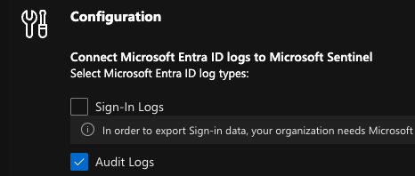

Microsoft Entra ID audit telemetry was connected to the Sentinel environment to provide the directory events required for identity-focused detection engineering.

---

## 2. Rogue MFA Registration

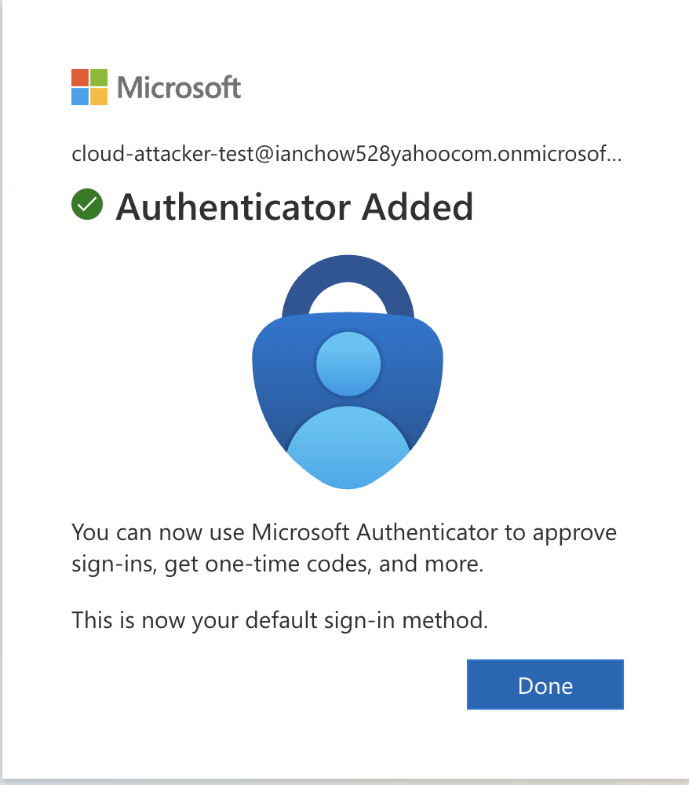

A controlled test account was used to register an additional Microsoft Authenticator method, simulating an attacker attempting to establish persistence after obtaining valid account credentials.

---

## 3. Audit Log Ingestion Validation

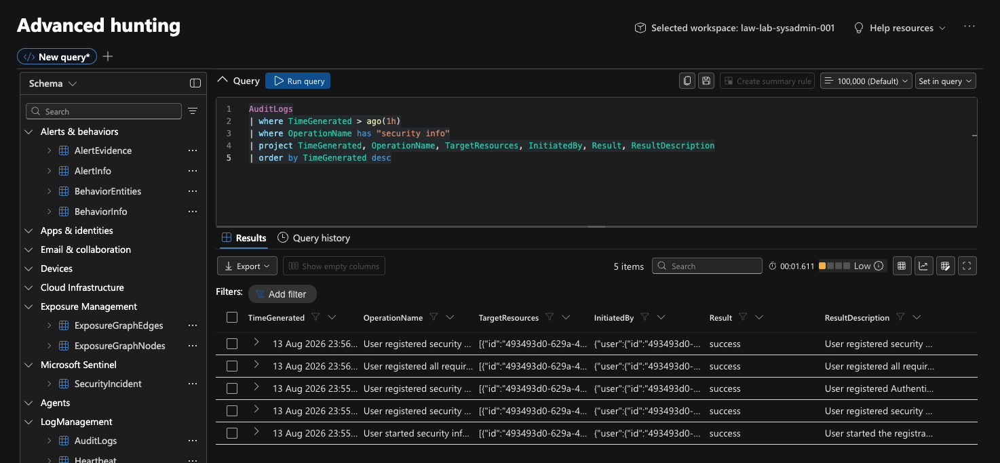

The generated MFA registration activity was validated in the ingested Microsoft Entra ID `AuditLogs` telemetry before building the detection rule.

Multiple audit events were generated during a single MFA registration workflow, demonstrating the need to understand the underlying event lifecycle before defining detection and grouping logic.

---

## 4. KQL Detection Results

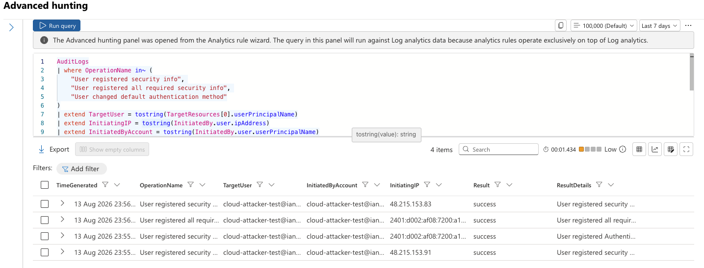

KQL was used to identify authentication method registration and modification events associated with the simulated MFA persistence activity.

Relevant operations included:

- `User registered security info`
- `User registered all required security info`
- `User changed default authentication method`

---

## 5. Sentinel Entity Mapping

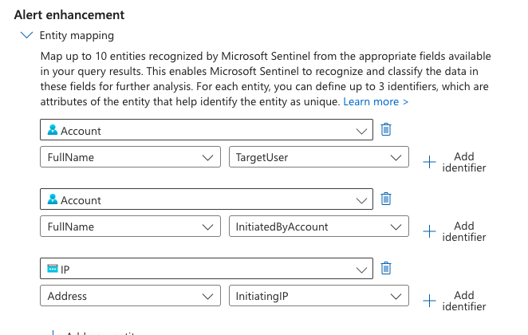

Detection output was mapped to Microsoft Sentinel entities so investigation context could be associated with the generated alert and incident.

Mapped entities included account and IP information used during analyst triage.

---

## 6. Alert Enrichment with Custom Details

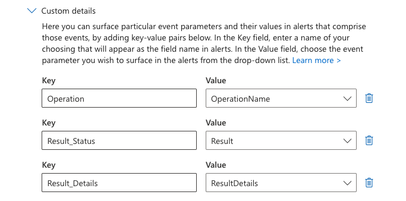

Custom details were configured to surface useful fields directly within the generated security alert.

These included contextual information such as the operation name, result, and result details.

---

## 7. Microsoft Sentinel Analytics Rule

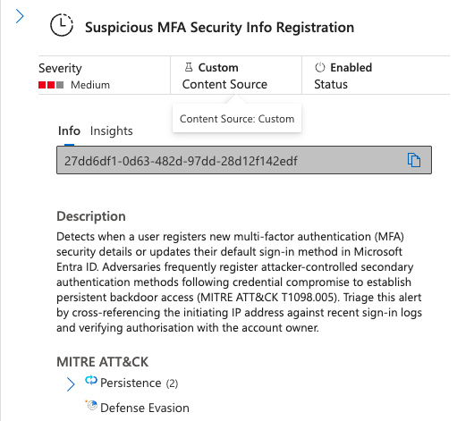

The custom scheduled analytics rule was deployed in Microsoft Sentinel to convert matching Entra ID audit activity into security alerts and incidents.

---

## 8. Duplicate Incidents Before Tuning

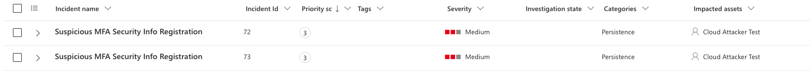

Initial testing showed that related audit events from a single MFA registration workflow could generate separate incidents.

This behaviour triggered further investigation into the Entra ID telemetry and Sentinel alert grouping configuration.

---

## 9. Account-Based Alert Grouping

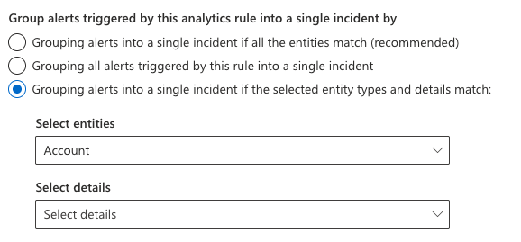

The alert grouping configuration was refined to correlate related activity based primarily on the affected Account entity over the configured grouping window.

The objective was to reduce duplicate incident creation while retaining the underlying alert and event context.

---

## 10. Tuned Incident Consolidation

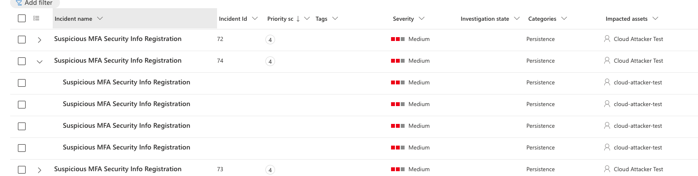

After tuning the grouping configuration and rerunning the MFA registration scenario, multiple related alerts were successfully consolidated into a single Sentinel incident.

This validated the revised correlation approach.

---

## 11. Triage Field Validation

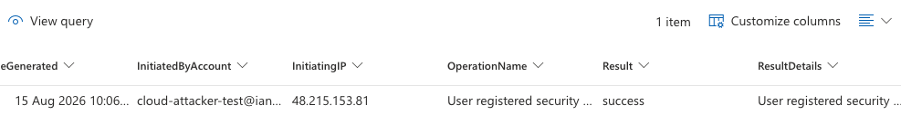

The final incident was reviewed to confirm that the relevant account, source IP, operation, and result information remained available for analyst investigation after the grouping changes.

---

## Evidence Workflow

```text
Entra ID Connector
        ↓
Rogue MFA Registration
        ↓
AuditLogs Validation
        ↓
KQL Detection
        ↓
Entity Mapping & Enrichment
        ↓
Sentinel Analytics Rule
        ↓
Duplicate Incident Identification
        ↓
Alert Grouping Tuning
        ↓
Incident Revalidation
        ↓
Analyst Triage
```

The screenshots demonstrate the progression from raw identity telemetry through detection development and incident tuning rather than isolated configuration steps.